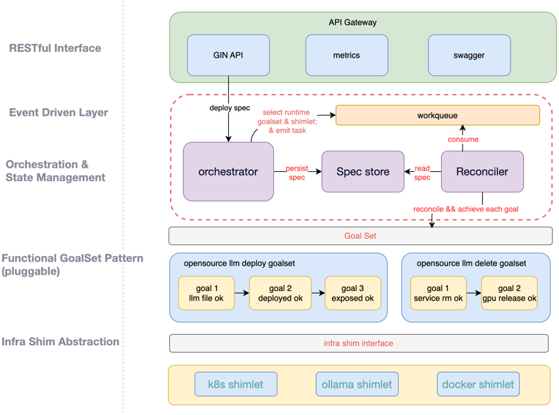

<div align="center">

<br>

[](LICENSE)
[](https://github.com/iflytek/Astron-xmod-shim/releases)
[](https://github.com/iflytek/Astron-xmod-shim/actions)
[](go.mod)
[](https://codecov.io/gh/iflytek/Astron-xmod-shim)

[](docs/k8s.md)
[](charts/)
[](https://cncf.io)
[](docs/metrics.md)
[](https://github.com/iflytek/Astron-xmod-shim/graphs/contributors)
[](https://github.com/iflytek/Astron-xmod-shim)
[](http://makeapullrequest.com)

<span style="font-size:0.9em; color:#586375;">**Language**: [English](README_en.md) | **简体中文**</span>


</div>

# Astron-xmod-shim
轻量级、声明式的 AI 服务管控中间件

## 项目概述
Astron-xmod-shim 是一款轻量级、声明式的 AI 服务管控中间件，它让用户通过 DeploySpec 声明期望状态，系统则围绕一组明确目标（Goals） 实现可靠收敛——目标可以是“模型存在”“服务就绪”“通过安全校验”等任意可验证状态。这些目标由 GoalSet 组织：系统内置常用模板（如 llm-deploy、llm-delete），开箱即用；也支持第三方自定义，灵活扩展部署语义。目标的具体执行通过 Shimlet 插件对接底层环境（如 Kubernetes、Docker），你专注定义“应该是什么样”，系统负责“在哪变成那样”。

## 🌟 核心设计理念：从意图到最终一致

Astron-xmod-shim 的设计围绕一个核心思想：**部署即收敛到一组明确目标（Goals）**。  
系统不规定“必须检查什么”，只提供“如何可靠地收敛到你定义的目标”。

- **部署意图：`DeploySpec`（用户侧）**  
  用户通过 `DeploySpec` 声明“要什么”，例如：
  > “部署一个名为 `qwen-test` 的模型服务，1 个副本，使用 1 张 NVIDIA GPU，模型使用 `qwen3-1.5b`。” 
  `DeploySpec` 是纯意图描述，不包含实现细节或环境绑定，确保接口简洁、平台无关。

- **`Goal`、`GoalSet` 与执行引擎**
    1. **`Goal`** 是一个明确的系统目标（如“模型文件存在”），包含：
        - `IsAchieved()`：判断目标是否已达成；
        - `Ensure()`：若未达成，则执行幂等修复动作。
    2. **`GoalSet`** 是一组有序 `Goal` 的集合，代表某类部署场景（如 LLM 上线、服务下线）的收敛路径。其内容完全开放，支持第三方扩展。
    3. **执行引擎**由 **`WorkQueue` + `reconcile loop`** 构成：
        - `WorkQueue` 提供可靠调度（去重、限速重试、背压控制）；
        - `reconcile loop` 持续消费任务，逐个收敛 `Goal`，直至状态一致。

- **`Shimlet`（运行时适配插件）**  
  `Shimlet` 实现 `shim.Runtime` 接口，封装底层环境（如 Kubernetes、Docker）的资源操作，通过接口抽象实现运行时解耦，支持多环境无缝切换。

- **轻量单体架构**  
  单二进制交付，无外部依赖，适用于边缘、本地及云原生等多种部署场景。


  


## 🏗️ 技术架构

ModelServeShim 采用“核心引擎 + 双插件”的解耦架构，通过抽象层与流程引擎分离关注点，实现高可扩展性与环境无关性。




## 快速开始

### 环境要求

- Go 1.20+（开发环境）
- 目标环境（如 K8s v1.20+，如需使用 K8s shimlet）

### 安装

```bash
# 下载二进制文件（Linux x86_64）
wget https://github.com/iflytek/astron-xmod-shim/releases/latest/download/model-serve-shim
chmod +x model-serve-shim

# 或从源码构建
git clone https://github.com/iflytek/astron-xmod-shim.git
cd astron-xmod-shim
make build
```

### 基本使用

```bash
# 启动服务，加载 K8s shimlet 和开源 LLM 部署流程
./model-serve-shim --port=8080 \    
  --shimlet=k8s \                  
  --pipeline=opensourcellm          
```

## API 参考

### 部署模型服务

```bash
curl -X POST http://localhost:8080/api/v1/modserv/deploy \   
  -H "Content-Type: application/json" \                      
  -d '{                                                      
    "modelName": "example-model",                         
    "modelFile": "/path/to/model",                        
    "resourceRequirements": {                              
      "acceleratorType": "NVIDIA GPU",                    
      "acceleratorCount": 1,                               
      "cpu": "4",                                         
      "memory": "16Gi"                                    
    },                                                       
    "replicaCount": 1                                       
  }'                                                         
```

### 查询服务状态

```bash
curl http://localhost:8080/api/v1/modserv/{serviceId}
```

### 列出已加载插件

```bash
curl http://localhost:8080/api/v1/plugins
```

## 插件开发指南

### Shimlet 开发（环境适配插件）

Shimlet 负责将抽象的部署请求转换为具体环境的操作。以下是开发自定义 shimlet 的示例：

#### 内置示例：Kubernetes Shimlet

ModelServeShim 原生内置了 Kubernetes Shimlet，用于在 Kubernetes 环境中部署模型服务。它实现了标准的 Shim 接口，能够将抽象部署请求转换为
Kubernetes 的资源操作（如创建 Deployment 和 Service 等）。

#### 步骤 1：实现 Shim 接口

```go
package myshimlet

import (
	"context"
	"astron-xmod-shim/internal/core/deploy"
)

// MyShimlet 实现自定义环境适配插件
type MyShimlet struct{}

// Create 创建资源
func (s *MyShimlet) Create(ctx *deploy.Context) (string, error) {
	// 实现创建资源的逻辑
	// 返回资源 ID
	return "resource-id", nil
}

// Status 查询资源状态
func (s *MyShimlet) Status(resourceID string) (deploy.Status, error) {
	// 实现查询资源状态的逻辑
	return deploy.StatusRunning, nil
}

// Delete 删除资源
func (s *MyShimlet) Delete(resourceID string) error {
	// 实现删除资源的逻辑
	return nil
}

// GetResourceInfo 获取资源详细信息
func (s *MyShimlet) GetResourceInfo(resourceID string) (map[string]interface{}, error) {
	// 实现获取资源详细信息的逻辑
	return map[string]interface{}{"id": resourceID}, nil
}
```

#### 步骤 2：注册插件

```go
package myshimlet

import (
	"astron-xmod-shim/internal/core/plugin"
)

// init 函数在插件加载时自动调用
func init() {
	// 注册自定义 shimlet
	plugin.RegisterShimlet("my-shimlet", &MyShimlet{})
}
```

### Pipeline 开发（部署流程插件）

Pipeline 定义了模型部署的具体步骤和执行逻辑。ModelServeShim 使用 Builder 模式实现 Pipeline，以下是开发自定义 pipeline 的示例：

#### 内置示例：OpenSourceLLM Pipeline

ModelServeShim 原生内置了 OpenSourceLLM Pipeline，用于开源大模型的部署流程。它采用 Builder
模式实现，包含生成服务ID、映射模型名称到路径、应用服务配置和暴露服务端点等关键步骤，使用户能够快速部署开源大模型服务。

#### 步骤 1：定义 Pipeline 步骤函数

```go
package mypipeline

import (
	"astron-xmod-shim/internal/core/pipeline"
	"astron-xmod-shim/pkg/log"
)

// 定义 pipeline 步骤函数，类型为 func(*pipeline.Context) error

// validateModel 验证模型有效性
func validateModel(ctx *pipeline.Context) error {
	log.Info("开始验证模型: %s", ctx.DeploySpec.ModelName)
	// 实现模型验证逻辑
	return nil
}

// processConfig 处理部署配置
func processConfig(ctx *pipeline.Context) error {
	log.Info("处理部署配置")
	// 实现配置处理逻辑
	return nil
}

// prepareResources 准备部署资源
func prepareResources(ctx *pipeline.Context) error {
	log.Info("准备部署资源")
	// 实现资源准备逻辑
	return nil
}
```

#### 步骤 2：创建并注册 Pipeline

```go
package mypipeline

import (
	"astron-xmod-shim/internal/core/pipeline"
)

// init 函数在插件加载时自动调用
func init() {
	// 使用 Builder 模式创建并注册自定义 pipeline
	myCustomPipeline()
}

// myCustomPipeline 创建自定义 pipeline 实例
func myCustomPipeline() *pipeline.Pipeline {
	// 使用 New() 创建 builder，Step() 添加步骤，BuildAndRegister() 完成构建并注册
	return pipeline.New("my-pipeline").
		Step(validateModel).
		Step(processConfig).
		Step(prepareResources).
		BuildAndRegister()
}
```

### 扩展示例：Docker Shimlet

除了内置的Kubernetes Shimlet外，开发者还可以实现Docker环境适配插件，将模型服务部署到Docker容器中。Docker Shimlet通过Docker
API创建和管理容器，支持模型服务的完整生命周期管理。

### 扩展示例：业务场景 Pipeline

开发者可以根据具体业务需求创建专用的Pipeline。例如：

- **多模态模型服务Pipeline**：增加针对文本和图像处理的特殊验证步骤、优化GPU分配策略、配置专用推理参数
- **边缘部署Pipeline**：添加资源限制检查、模型量化优化、离线推理支持等特殊步骤
- **企业级安全Pipeline**：集成身份验证、加密传输、访问控制等安全增强功能

### 插件集成方式

ModelServeShim 使用 Go 语言的初始化注册机制实现插件集成，而不是通过共享库编译和热加载。

#### 内置插件集成

内置插件（如 Kubernetes Shimlet）通过在 `init()` 函数中自动注册到框架中：

```go
// K8sShimlet 的注册方式示例
func init() {
shimlet.Registry.AutoRegister(&K8sShimlet{})
}
```

#### 自定义插件集成

自定义插件可以通过以下方式集成到 ModelServeShim 中：

1. **实现标准接口**：按照文档中示例实现 `Shimlet` 或 `Pipeline` 接口
2. **自动注册**：在 `init()` 函数中使用注册表完成自动注册
3. **重新编译**：将自定义插件代码放在正确的包路径下，然后重新编译整个应用程序

#### 插件选择与配置

通过命令行参数或配置文件指定要使用的插件：

```bash
# 通过命令行指定插件
./model-serve-shim --shimlet=k8s --pipeline=opensourcellm

# 通过配置文件指定插件
# config.yaml 中设置
defaultShimlet: k8s
defaultPipeline: opensourcellm
```

## 配置说明

ModelServeShim 支持通过命令行参数和配置文件进行配置：

### 命令行参数

```bash
./model-serve-shim --help

Usage of model-serve-shim:
  --port int              服务监听端口 (默认: 8080)
  --config string         配置文件路径
  --shimlet string        默认加载的 shimlet 插件
  --pipeline string       默认加载的 pipeline 插件
  --plugin-dir string     插件目录路径
  --log-level string      日志级别 (debug, info, warn, error) (默认: "info")
```

### 配置文件

配置文件采用 YAML 格式：

```yaml
# config.yaml
service:
  port: 8080
  readTimeout: 30s
  writeTimeout: 30s

plugins:
  defaultShimlet: k8s
  defaultPipeline: opensourcellm
  pluginDir: ./plugins
  preload:
    - type: shimlet
      path: ./plugins/myshimlet.so
    - type: pipeline
      path: ./plugins/mypipeline.so

logging:
  level: info
  format: text
  output: stdout
```

## 贡献指南

我们欢迎社区贡献，贡献前请阅读以下指南：

1. Fork 仓库并创建自己的分支
2. 遵循项目代码规范（使用 pre-commit 进行代码风格检查）
3. 提交代码前确保通过所有测试
4. 提交 Pull Request，描述清楚所做的变更和解决的问题

## 🌟 Star 历史

<div align="center">
  
</div>

## 许可证

ModelServeShim 使用 Apache License 2.0 许可证。

## 联系我们

如有问题或建议，请通过以下方式联系我们：

- GitHub Issues: https://github.com/iflytek/astron-xmod-shim/issues
- Email: hxli28@iflytek.com